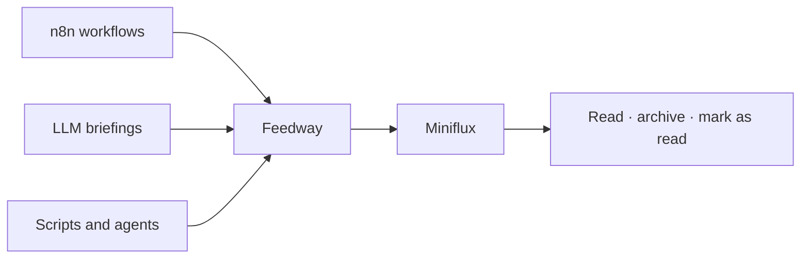

# 📰 Feedway

[](https://github.com/zewelor/feedway/actions/workflows/ci.yaml)

**Turn generated briefings into a feed you can actually read.**

Feedway is a tiny, self-hosted bridge between systems that produce news and the
feed reader you already use. Send HTML from n8n workflows, scripts, agents, or
your own LLM pipelines. Feedway turns it into one public
[JSON Feed 1.1](https://www.jsonfeed.org/version/1.1/) that Miniflux can follow.



Different automations can publish into the same stream. Feedway handles safe
HTML, retries, and retention; Miniflux handles subscriptions, unread state,
history, and reading. Each project stays small by doing one job.

## ✨ What it does

- exposes one authenticated endpoint for publishing entries;
- serves one public feed at `/feed.json`;
- deduplicates retries using a deterministic content hash;
- sanitizes HTML with Bluemonday's conservative UGC policy;
- keeps the latest 100 entries in the feed;
- deletes database entries after 60 days by default;
- supports ETag, conditional requests, `GET`, and `HEAD`;
- runs with PostgreSQL 18 in Docker Compose;
- ships as a static, distroless, non-root container.

There are deliberately no users, dashboards, feed-management APIs, plugins, or
configuration for values that can be conventions.

## 🚀 Quick start

You need Docker with Docker Compose and `curl`. Create a directory for the
deployment and generate its secrets:

```bash
mkdir feedway && cd feedway
umask 077
export API_TOKEN="$(openssl rand -hex 32)"
export DB_PASSWORD="$(openssl rand -hex 32)"
printf 'API_TOKEN=%s\nDB_PASSWORD=%s\n' "$API_TOKEN" "$DB_PASSWORD" > .env
```

Download the Compose example from `main` and start Feedway:

```bash
curl --fail --location \
  --output compose.yaml \
  https://raw.githubusercontent.com/zewelor/feedway/main/compose.example.yaml
docker compose up -d
docker compose ps
curl --fail http://localhost:8080/readyz
```

The example runs `ghcr.io/zewelor/feedway:latest`. Every green push to `main`
publishes that rolling tag together with an immutable full-commit-SHA tag.

Feedway prepares its single database table automatically. There is no migration
command to run.

## 📬 Publish a briefing

```bash
curl --fail-with-body \
  --request POST \
  --header "Authorization: Bearer $API_TOKEN" \
  --header 'Content-Type: application/json' \
  --data '{
    "title": "Morning briefing",
    "content_html": "<h2>Today</h2><p>Three systems reported healthy.</p>"
  }' \
  http://localhost:8080/api/v1/entries
```

The first request returns `201 Created`:

```json
{"result":"created","id":"sha256-v1:..."}
```

Sending the same final content again returns `200 OK` with
`"result":"deduplicated"` and the same ID. This makes retries safe without
client-generated identifiers.

## 📐 API contract

Feedway has exactly one hardcoded feed named `Feedway`. It accepts entries only
through `POST /api/v1/entries` and serves the public feed only at `/feed.json`.
There is no feed identifier, management API, landing page, `home_page_url`, or
`feed_url`.

The request is a JSON object with these fields:

| Field | Required | Limit |
| --- | --- | --- |
| `content_html` | yes | 256 KiB before and after sanitization |
| `title` | no | 1,000 Unicode characters |

The request body is limited to 1 MiB and unknown fields are rejected. Feedway
normalizes line endings and surrounding whitespace, sanitizes HTML, and hashes
the final title and HTML into a `sha256-v1:<hex>` identifier. Entries are
immutable: changed content creates a new entry; identical final content is
deduplicated.

`GET` and `HEAD /feed.json` return the latest 100 entries as JSON Feed 1.1. The
uncompressed representation is limited to 1 MiB and includes
`content_html`, `date_published`, and an optional `title`. Feedway does not
compress responses or emit `Last-Modified`; a reverse proxy may add
compression.

Application errors use one shape:

```json
{"error":"content_html is required"}
```

Expected statuses are `400` for invalid JSON, `401` for invalid credentials,
`413` for an oversized request, `415` for a non-JSON request, `422` for invalid
content or an oversized feed, `500` for an unexpected failure, and `503` when
readiness fails. Unknown paths and unsupported methods use the standard Go
`net/http` responses.

## 🔎 Read and verify the feed locally

Open [http://localhost:8080/feed.json](http://localhost:8080/feed.json) in a
browser or use `curl`:

```bash
curl --fail http://localhost:8080/feed.json
```

Verify conditional requests:

```bash
etag="$(curl --fail --silent --head http://localhost:8080/feed.json \
  | sed -n 's/^[Ee][Tt][Aa][Gg]:[[:space:]]*\(.*\)\r$/\1/p')"

curl --include \
  --header "If-None-Match: $etag" \
  http://localhost:8080/feed.json
```

The second command should return `304 Not Modified` with no body.

## 🤖 Publish from n8n

Many independent workflows can end with the same **HTTP Request** node. For
example, one workflow can summarize infrastructure alerts, another can build an
LLM news briefing, and a third can collect release notes. They all publish to
Feedway and appear in one Miniflux subscription.

Configure the node with:

- **Method:** `POST`
- **URL:** `https://feed.example.com/api/v1/entries`
- **Authentication:** a Header Auth credential containing
  `Authorization: Bearer <API_TOKEN>`
- **Body Content Type:** JSON
- **JSON Body:**

```javascript
{{ {
  title: $json.title,
  content_html: $json.content_html
} }}
```

Store the token in an n8n credential rather than directly in the workflow. The
upstream node only needs to produce `title` and `content_html`. An empty title is
allowed; `content_html` is required.

## 📖 Read it in Miniflux

After deploying Feedway somewhere Miniflux can reach, add this subscription in
Miniflux:

```text
https://feed.example.com/feed.json
```

Feedway does not need a `BASE_URL`: the MVP does not emit self-referential URLs.
The production Miniflux smoke test is intentionally left until the first real
deployment, where network routing and TLS can be verified together.

## ⚙️ Configuration

| Variable | Required by app | Compose example | Purpose |
| --- | --- | --- | --- |
| `API_TOKEN` | yes | from `.env` | Bearer token, at least 32 bytes |
| `DB_PASSWORD` | yes | from `.env` | PostgreSQL password |
| `DB_HOST` | yes | `postgres` | PostgreSQL host |
| `DB_PORT` | no | `5432` | PostgreSQL port |
| `DB_NAME` | yes | `feedway` | PostgreSQL database |
| `DB_USER` | yes | `feedway` | PostgreSQL user |
| `RETENTION_DAYS` | no | `60` | Days to retain entries |

The HTTP address (`:8080`), feed size, request size, item count, timeouts, and
cleanup interval are conventions, not configuration.

## ☁️ Stateless deployment

Feedway itself does not need a persistent disk. In Kubernetes, run only the
stateless Feedway container and provide `DB_*` values for an existing
PostgreSQL server. The PostgreSQL service in `compose.example.yaml` is a
convenience for a small single-host installation, not a requirement of the
application image.

If you do not already operate PostgreSQL, managed services with a free plan can
be useful starting points for a small deployment:

- [Neon](https://neon.com/pricing) — serverless PostgreSQL with scale-to-zero;
- [Aiven](https://aiven.io/docs/products/postgresql/concepts/pg-free-tier) — a
  small managed PostgreSQL instance;
- [Supabase](https://supabase.com/pricing) — a PostgreSQL project with a broader
  application platform around it.

Free-plan limits and availability can change, so verify the current terms
before deployment. Feedway does not include Kubernetes manifests; connect it to
the database using the conventions of your existing platform.

## 🩺 Operations

```text
GET /healthz  process is alive; does not query PostgreSQL
GET /readyz   startup finished, PostgreSQL responds, shutdown has not started
```

Successful probes are not logged. Other requests use structured JSON logs:

```bash
docker compose logs -f feedway
```

Retention runs once at startup and then every 24 hours. Override its 60-day
default only when the deployment has a concrete reason:

```text
RETENTION_DAYS=90
```

## 🧰 Troubleshooting

- **Compose says `API_TOKEN` or `DB_PASSWORD` is required:** create `.env` as
  shown in Quick start and run the command from the deployment directory.
- **Feedway exits with `API_TOKEN must be at least 32 bytes`:** generate a
  longer token; `openssl rand -hex 32` produces 64 characters.
- **`/readyz` returns 503:** inspect `docker compose ps` and
  `docker compose logs postgres`.
- **Publishing returns 401:** check the `Authorization: Bearer ...` header.
- **Publishing returns 422:** the HTML is empty after sanitization or exceeds
  the documented limit.
- **Port 8080 is already allocated:** stop the conflicting process. The MVP
  intentionally has one fixed listen port.

## 🧪 Development

All Go tests and quality tools run inside Docker:

```bash
just test
just ci
```

`just test` is the package acceptance gate. `just ci` additionally checks
formatting, modules, vet, golangci-lint, govulncheck, and the production image.

Deferred ideas live in [docs/future-ideas.md](docs/future-ideas.md). They are
not an active roadmap.
