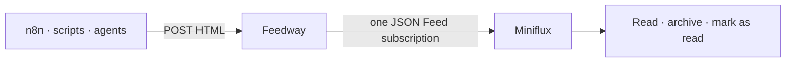

# 📰 Feedway

[](https://github.com/zewelor/feedway/actions/workflows/ci.yaml)

**Read reports, digests, and other generated content in your feed reader.**

## 🗺️ Overview

Feedway puts content from your automations into the same reading queue as your
RSS subscriptions.

n8n workflows, scripts, agents, and LLM pipelines send HTML to Feedway through
a simple API. Feedway publishes everything as one
[JSON Feed 1.1](https://www.jsonfeed.org/version/1.1/) subscription that you add
to Miniflux once:

```text
https://feed.example.com/feed.json
```

JSON Feed is an alternative feed format to RSS. Miniflux reads it in the same
way: new entries appear in your reading queue, where you can read, archive, and
mark them as read. The name combines **feed** and **gateway**.



Different automations can publish into the same stream. Feedway handles HTML
sanitization, retry deduplication, and retention; Miniflux handles subscriptions,
unread state, history, and reading. Each project stays small by doing one job.

## 🔄 How it works

Content generated by automations often has no stable URL that a feed reader can
poll. Daily reports, database summaries, and AI-generated digests therefore tend
to land in email inboxes or chat channels, mixed together with messages that
need immediate attention. Those tools can archive content and track state, but
they organize it around conversations rather than a dedicated reading queue.

Feedway provides the missing bridge between generated content and that existing
reading workflow.

**Feedway changes the flow:**

1. **You push** HTML to Feedway through one authenticated API endpoint.
2. **Feedway sanitizes and stores** each entry, then serves entries as a public
   JSON Feed at `/feed.json` and individual pages under `/entries/{id}`.
3. **Your feed reader pulls** that feed and handles reading, archiving, and
   history.

The separation is deliberate. Feedway accepts and serves generated entries;
the feed reader remains responsible for subscriptions, unread state, filtering,
shortcuts, and notifications. Each tool keeps doing one job well.

## ✨ What it does

- exposes one authenticated endpoint for publishing entries;
- serves one public feed at `/feed.json`;
- serves a minimal public HTML page for each retained entry;
- deduplicates retries using a deterministic content hash;
- sanitizes HTML with Bluemonday's conservative UGC policy;
- keeps up to the latest 100 entries that fit within the 16 MiB feed limit;
- deletes database entries after 60 days by default;
- supports ETag, conditional requests, `GET`, and `HEAD`;
- runs with PostgreSQL 18 in Docker Compose;
- ships as a static, distroless, non-root container.

There are deliberately no users, dashboards, feed-management APIs, plugins, or
configuration for values that can be conventions.

## 💡 Example use cases

- **AI and news briefings:** collect selected posts, release notes, or articles,
  summarize them with an LLM, and publish one readable digest.
- **Newsletter ingestion:** parse incoming newsletters and move their content
  into the same reading workflow as regular feed subscriptions.
- **Operations reports:** publish scheduled infrastructure, database, or product
  metrics without building a dedicated dashboard for every small report.
- **Transcripts:** turn saved videos or podcasts into readable summaries that
  can be archived and revisited later.
- **Website monitoring:** publish changes from websites that do not provide
  feeds of their own.

## 🚀 Quick start

You need Docker with Docker Compose, `curl`, and `openssl`. Create a directory
for the deployment and generate its secrets:

```bash
mkdir feedway && cd feedway
umask 077
export API_TOKEN="$(openssl rand -hex 32)"
export DB_PASSWORD="$(openssl rand -hex 32)"
printf 'API_TOKEN=%s\nDB_PASSWORD=%s\n' "$API_TOKEN" "$DB_PASSWORD" > .env
```

Download the Compose example from `main` and start Feedway:

```bash
curl --fail --location \
  --output compose.yaml \
  https://raw.githubusercontent.com/zewelor/feedway/main/compose.example.yaml
docker compose up -d
docker compose ps
curl --fail http://localhost:8080/readyz
```

The example publishes host port 8080 to the container's port 80 and prepares
the single database table automatically. There is no migration command to run.
It uses `ghcr.io/zewelor/feedway:latest`; every green push to `main` also
publishes an immutable full-commit-SHA image tag.

For external PostgreSQL or other deployment environments, see the
[deployment guide](docs/deployment.md).

## 📬 Publish an entry

```bash
curl --fail-with-body \
  --request POST \
  --header "Authorization: Bearer $API_TOKEN" \
  --header 'Content-Type: application/json' \
  --data '{
    "title": "Morning briefing",
    "content_html": "<h2>Today</h2><p>Three systems reported healthy.</p>"
  }' \
  http://localhost:8080/api/v1/entries
```

The first request returns `201 Created`. Publishing the same final content
again returns `200 OK` with `"result":"deduplicated"` and the same ID, making
retries safe without client-generated identifiers.

The complete request, response, error, feed, cache, and probe contract lives in
the [HTTP API reference](docs/api.md).

## 📚 Documentation

The [documentation handbook](docs/README.md) is the index for the detailed
operator and integration guides:

- [HTTP API](docs/api.md) — publish entries, read entries and the feed, and inspect probes;
- [Deployment](docs/deployment.md) — Compose, configuration, and external PostgreSQL;
- [Integrations](docs/integrations.md) — n8n, Miniflux, and local verification;
- [Operations](docs/operations.md) — logs, retention, probes, and troubleshooting.

Deferred ideas are kept separately in [docs/future-ideas.md](docs/future-ideas.md).
They are not an active roadmap.

## 🧪 Development

All tests and quality tools run inside Docker:

```bash
just hooks-install
just format-markdown
just lint-markdown
just test
just ci
```

Run `just hooks-install` once after cloning. It configures Git's repository-local
`core.hooksPath` to use the tracked `.githooks/`; no additional hook manager is
required.

The pre-push hook runs the complete `just ci` gate before every push. GitHub
Actions runs the same gate again, so local hooks provide fast feedback without
replacing the authoritative remote check.

`just format-markdown` applies safe automatic Markdown fixes. Long prose lines
reported by `just lint-markdown` still need to be wrapped manually. `just test`
is the package acceptance gate. `just ci` additionally checks Markdown and Go
formatting, modules, vet, golangci-lint, govulncheck, and the production image.

## 📄 License

Feedway is available under the [MIT License](LICENSE).
